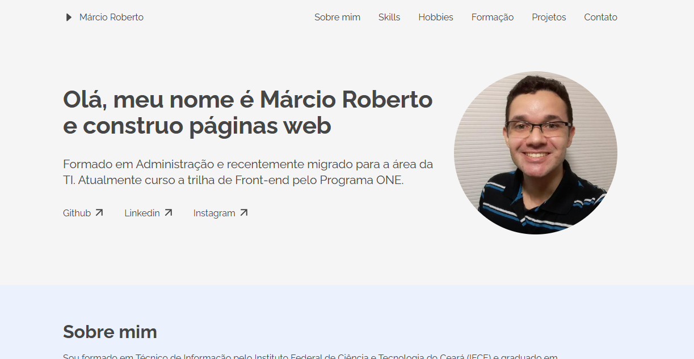

<h1 align="center"> PORTFÓLIO </h1>

Primeiro Challenge proposto na fase de especialização em Front-end do Programa ONE (Alura + Oracle).

  <a href="#-tecnologias">Tecnologias</a>&nbsp;&nbsp;&nbsp;
  |&nbsp;&nbsp;&nbsp;
  <a href="#-projeto">Projeto</a>&nbsp;&nbsp;&nbsp;
  |&nbsp;&nbsp;&nbsp;
  <a href="#-layout">Layout</a>&nbsp;&nbsp;&nbsp;
  |&nbsp;&nbsp;&nbsp;
  <a href="#-badge">Badge</a>&nbsp;&nbsp;&nbsp;

 

  

## 🚀 Tecnologias

Esse projeto foi desenvolvido com as seguintes tecnologias:

- HTML e CSS
- JavaScript
- Git e Github

## 💻 Projeto

O Portfólio é um projeto feito com o objetivo de apresentar um rápido resumo sobre mim e mostrar alguns outros projetos feitos durante meu estudo.

[LINK PORTFOLIO](https://marciorobertomr.github.io/Portfolio/)

## 🔖 Layout

Você pode visualizar o layout do projeto através [DESSE LINK](https://www.figma.com/file/Mv4mSxBHzB5caI7bW2tLv6/Challenge-Front-end-Portf%C3%B3lio?node-id=0%3A1). É necessário ter conta no [Figma](https://figma.com) para acessá-lo.

## 📝 Badge

Abaixo a Badge conquistada pela conclusão do Challenge.

  

